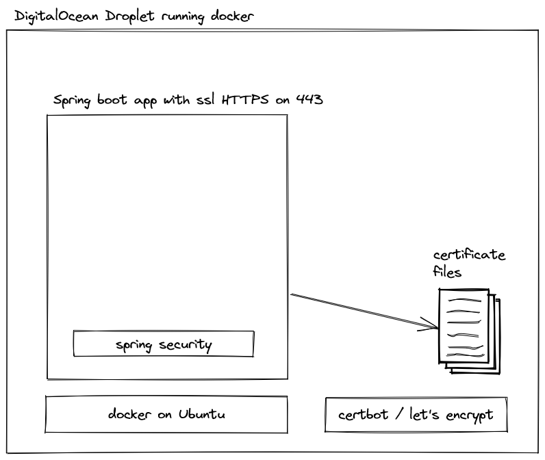

# spring-boot-https

## The Big Picture



## Get the Certificate

Using [cerbot](https://certbot.eff.org/) to get a certificate:

> [Tutorial: How To Use Certbot Standalone Mode to ... by DigitalOcean](https://www.digitalocean.com/community/tutorials/how-to-use-certbot-standalone-mode-to-retrieve-let-s-encrypt-ssl-certificates-on-ubuntu-22-04)

## Run the Application

```bash
docker run -d \
    --name spring-https \
    -p 443:8443 \
    -v '/etc/letsencrypt/live/<you-domain>/keystore.p12:/ssl/keystore.p12' \
    -e 'SERVER_SSL_KEY_STORE=/ssl/keystore.p12' \
    -e 'SERVER_SSL_KEY_ALIAS=spring-https' \
    ghcr.io/garodriguezlp/spring-boot-https:main
```
